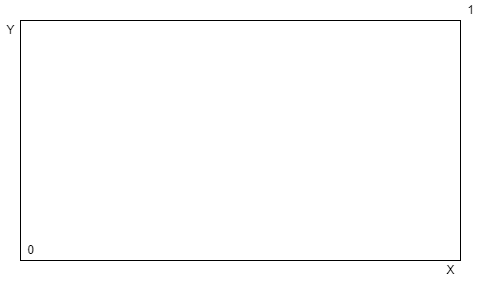
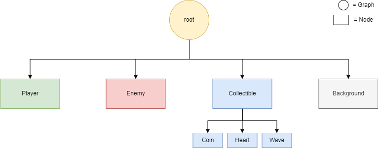

# Prima Checklist: *Flappy Bug*
---

  
##### *Concept art: Enemies (blue) move from right to left. Player (red) can move in any direction. Player must evade the enemies and optionally pick up collectibles for higher scores. Some collectibles can have a negative effects such as faster flying enemies, or a higher concentration of enemies.* 
 
 

| Nr | Criterion       | Explanation                                                                                                           |
|:---:|-------------------|---------------------------------------------------------------------------------------------------------------------|
|  0 | Units and Positions |    All of the resources will be placed on the XY-Axis.  The 0 point will be located in the bottom left corner and the 1 will be located in the top right corner.  All objects will be 1x1m.                                   |
|  1 | Hierarchy         |   The scene starts with a basic *root*-graph. This will contain all the elements in the scene.  In the *root* there will be a *Player*-Node, which will contain the *Player*-Components.  The *Enemy*-Node and its Components will be bundled into a graph for further duplication.  The *Collectible*-Branch has three Leafs (*Coin*, *Heart*, *Wave*) which represent pick up items while playing.  At last there is a *Background*-Node for a simple game background (uses background texture scrolling.).                                                 |
|  2 | Editor            | *Player* will be created by code. Player stats like score and name (and maybe player character), will be saved in that class.  *Enemy*- and *Collectible*-Nodes/Graphs are created in the Editor, however further instances will be created by code for simplicity.  The *Background*-Node will also be created in the Editor.                                   |
|  3 | Scriptcomponents  | All enemies and collectibles will have a custom script defining their movement and when they can be deleted again. Some Nodes will randomly get Custom Scripts which will randomize their behaviour. For instance there could be a bird that doesn't fly straight, but in a sine-curve motion. Same with the *Collectibles*.  Position of *Enemy* will be broadcasted to the *Player* for him to handle the Event.                                 |
|  4 | Extend            |   *Collectible*-Class inherits from the Node Class and *Coin*, *Heart*, *Wave* inherit from the *Collectible*-Class. *Player*-Node must be derived from Super-Class-*Node*.  Gamestate will extend *Mutable*-Class for updating score and health in the UI, aswell as changing the player name and displaying it.                         |
|  5 | Sound             | Sounds will occur on collision with enemies and collectibles. There will also be a background music and a losing screen music.                     |
|  6 | VUI               | Menu Screen with start button and settings option.  Settings configuration will lead you to another page where you can get insight to the controls and change your name (aswell as maybe player character).  High score will be presented during the menu screen and while playing, and the current score will be shown while playing.  Additionally there will be an indicator on how many lives the player has left.  When the player has no lives anymore, he will be redirected to an End-Screen, where he can choose to restart.                |
|  7 | Event-System      | *Player* has an Event Handler that gets receives the current position of the *Enemies* in each Frame. |
|  8 | External Data     | High score and player name can be stored and loaded in the local storage of the browser.   |
|  9 | Light             | No light necessary.            |
|  A | Physics           | Flappy Bird style gravity.              |
|  B | Net               |                                                                      |
|  C | State Machines    | State machines to change enemy behaviour.        |
|  D | Animation         | Enemies flying could be animated using sprites.                      |