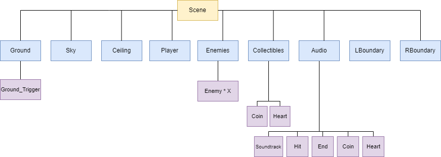

# PRIMA
Final submission for the module *Prototyping of interactive media applications and games* at Hochschule Furtwangen

Title: FlappyBug  
Author: Nathaniel Keeler  
Summerterm 2022  
MIB 7  
Course: PRIMA  
Docent: Prof. Jirka Dell'Oro-Friedl  
Executable: https://nathanielkeeler.github.io/Prima-Endabgabe/FlappyBug/index.html  
Source-Code: https://github.com/nathanielkeeler/Prima-Endabgabe/tree/main/FlappyBug  
Design-Document: https://github.com/nathanielkeeler/Prima-Endabgabe/tree/main/Design/design-document.pdf  
Instructions:   
Fly -> Spacebar (hold)  
Goal:
- Survive as long as possible!  
- Don't get snacked  
- Collect coins for a higher score  
- Collect hearts to survive longer

Checklist
============================================

| Criterion                        |      Explanation        |
|-------------------------|------------------------------------------------------------------------------------------------------------------------------------------------------------------------------------------------------------------------------------------------------------------------------------------------------------------------------------------------------------------------------------------|
|  1. Units and Positions | The 0 position is at the centre of the playing field. 1 is the measurement in which the the playing field is measured. The field has a dimension of 4x2. Therefore you have an area of -1 to 1 on the Y-Axis, where enemies and items are able to spawn. Player, Enemies and Items are scaled down to fit the playing field.      |
|  2. Hierarchy           |        *Enemies*- and *Collectibles* are container nodes for when subnodes are spawned by code and get added as a child. The *Audio* node holds multiple audio files which are then played whenever they are called upon. *Ground* and *Sky* nodes create the ground and sky in the scene. The nodes that are left are for creating physical barriers so that the player cant escape the playing field.  |
| 3. Editor               | *Player*, *Enemy*, *Coin* and *Heart* are created in Code since they all have different properties, some of which are shared. Also, things like sprite animations are found to be similar and can quickly be applied to all of these classes in code, while tweaking some parameters.       |
| 4. Scriptcomponents     | Script-Components are used for Enemies and Collectibles and define different movement patterns, which can be randomly added or switched.         |
| 5. Extend               | The *Player*, *Enemy*, *Coin* and *Heart* classes extend the ƒ.Node class while the script components *LinearMovementScript*, *SineMovementScript*, *CoinMovementScript* and *HeartMovementScript* extend the ƒ.ComponentScript class.        |
|  6. Sound               | Sounds are used for background music, flying, hits against the ground or enemies, collectible pick ups, and when the game is over.         |
| 7. VUI                  | The VUI displays the current score, the number of lives and the high score.          |
| 8. Event-System         | The Event-System is used for collision handling. When a collision occurs between the player and objects that have their physical properties set to *is_trigger*, a physics event is colled which handles the colliding objects appropriately.        |
| 9. External Data        | The *data.json* file is used for changing different game parameters such as the game speed, the starting highscore you compete against and how many enemies are going to be spawned. Once you surpass the highscore from the json file, your highscore gets saved in the local storage and gets displayed in the game from then on.         |
| B. Physics              | Almost all nodes have rigidbody components. While some just have these for easier collision detection with the player, the player actually uses physics for the controls. When the spacebar is held, a constant upward force is applied to the player, which creates a more realistic feeling for the flying-controls.        |
| E. Animation            | The *Player*, *Enemy* and *Coin* objects all have animations using spritesheets.         |